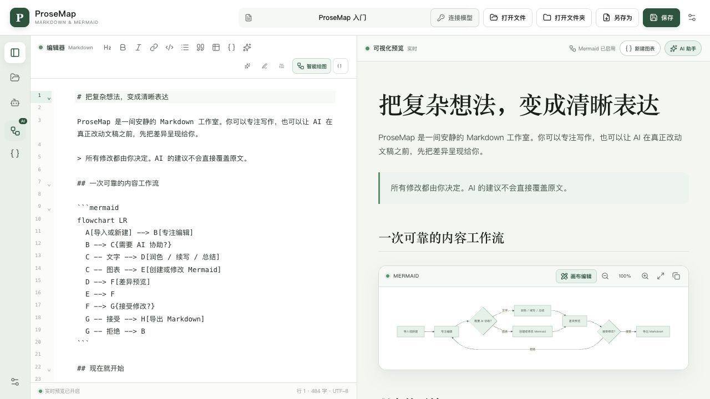
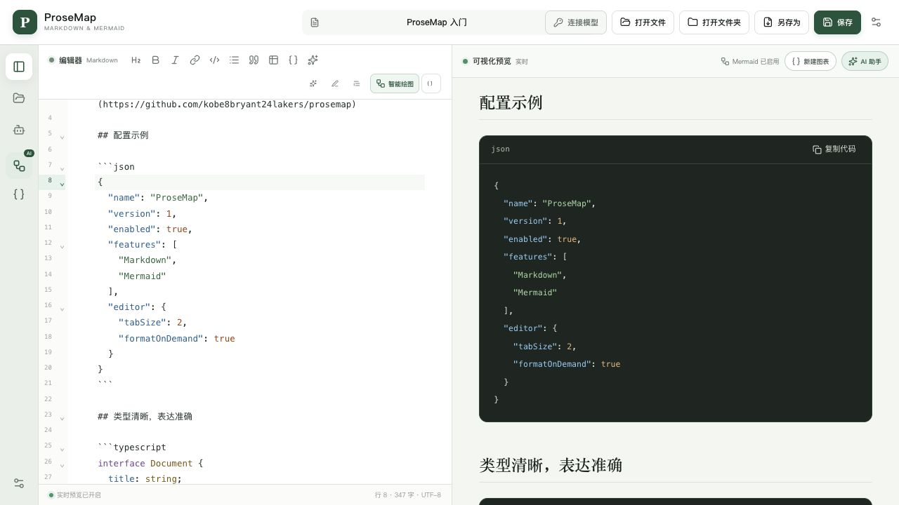
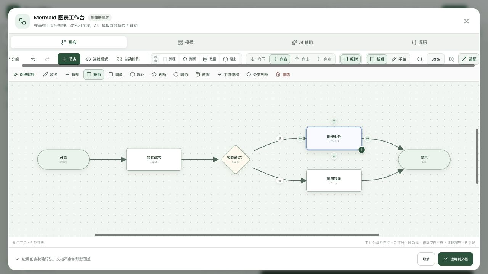

# ProseMap

> Write in flow. See the structure.

ProseMap is a local-first AI Markdown and Mermaid editor for macOS and Windows. It combines focused writing, live visual preview, native file and folder workflows, and reviewable AI-assisted edits in a single desktop application.

The application starts in English and supports instant switching to Simplified Chinese. Your language choice is saved locally; documents and diagram drafts keep their original content.

## In pictures

### Focused writing with live preview

Write Markdown beside the rendered document, including tables, links, and locally rendered Mermaid diagrams.



### Readable code, in source and preview

Language-aware syntax highlighting distinguishes properties, strings, numbers, and keywords. Format the current code block with one action and copy rendered code without selecting it manually.



### A visual Mermaid workbench

Select, rename, connect, and arrange diagram nodes directly on the canvas, with templates and source editing close at hand.



Screenshots show the actual production frontend with sample documents. Native file operations and external-link opening are provided by the desktop shell.

## Highlights

- Open individual Markdown files or browse every Markdown document in a local folder.
- Edit Markdown with a responsive desktop-first workspace and live preview.
- Highlight common fenced-code languages in both the editor and preview; copy code directly from each preview block.
- Edit code with two-space indentation, Tab / Shift+Tab, bracket matching and completion, and folding.
- Format the current code block with Prettier and undo the change in one step.
- Open HTTP/HTTPS links in the system browser, mail links in the default mail application, and heading anchors inside the preview.
- Render Mermaid diagrams locally in strict security mode, including node descriptions and branch labels.
- Create diagrams from natural-language instructions, edit Mermaid source, or directly manipulate flowcharts, sequence diagrams, state diagrams, class diagrams, ER models, mind maps, and Gantt plans on a canvas.
- Start from common templates including basic flowcharts, 4+1 architecture views, sequence diagrams, state diagrams, class diagrams, ER diagrams, Gantt charts, mind maps, use cases, and package structures.
- Edit use cases and nested packages using standard Mermaid flowcharts: actors, system boundaries, include/extend relationships, package membership, and module dependencies are preserved when switching between source and canvas.
- Scroll the document normally over inline diagrams, or open a scrollbar-free fullscreen view to zoom with the wheel, drag to pan, and click the percentage to reset.
- Insert new diagrams at the editor caret captured before opening the workbench.
- Keep diagrams with ordinary Mermaid comments visually editable. Sequence diagrams also accept Unicode participant identifiers, activation markers, notes, boxes, loops, alternatives, and parallel/optional/critical blocks without discarding their structure.
- In structured sequence diagrams, edit participants and messages on the canvas; control statements remain preserved in source order and are inspected from the canvas. Change the control structure in the source tab; newly added messages are appended after existing statements.
- Import class/ER directions and Unicode identifiers, separate class member declarations, standalone states and state descriptions, and plain-text mind map roots into the canvas. Isolated states survive document updates.
- Use AI on the full document or a selection for polishing, continuation, summarization, and custom transformations.
- Attach up to 12 explicitly selected UTF-8 reference, configuration, and source-code files so text and Mermaid AI edits can use project context beyond the active document.
- Review streamed AI output as a line-by-line diff before accepting or rejecting it.
- Connect to OpenAI-compatible Chat Completions endpoints or Anthropic Claude Messages endpoints.
- Save safely back to the original file or export with Save As.

## Code editing

Add a language after the opening fence, such as `json`, `jsonc`, `javascript`, `typescript`, `python`, `sql`, or `yaml`. Highlighting grammars are loaded locally on demand; unknown languages remain readable as plain text.

| Action | Shortcut / control |
| --- | --- |
| Format the current code block | `Cmd+Shift+F` on macOS / `Ctrl+Shift+F` on Windows, or the format button in the editor toolbar |
| Indent / outdent | `Tab` / `Shift+Tab` |
| Leave Tab indentation mode | Press `Esc`, then `Tab` to move keyboard focus |
| Undo formatting | `Cmd+Z` / `Ctrl+Z` |
| Fold a code block | Click the fold marker beside its opening fence |
| Copy preview code | Click the copy button in the code block header |

Formatting supports JSON, JSONC, JSON5, JavaScript/JSX, TypeScript/TSX, CSS/SCSS/Less, HTML/Vue, YAML, and GraphQL. Place the caret in a language-labelled, top-level fenced block. Formatting is explicit and affects only that block; invalid syntax, unsupported languages, and edits made while formatting is loading leave the document unchanged. List- and quote-nested blocks retain highlighting but are not automatically formatted. JSON formatting preserves large numeric literals and duplicate keys.

Preview heading links use lowercase, punctuation-free IDs with spaces replaced by hyphens (for example, `#hello-world`); Chinese headings are supported. Duplicate headings receive numeric suffixes. Relative file links are not yet resolved against the active document.

## Desktop support

| Platform | Status |
| --- | --- |
| macOS 11+ on Apple silicon | Built and locally verified |
| Windows 10/11 x64 | NSIS and MSI packages share one compatible build; WebView2 bootstrapper configuration is included |
| macOS on Intel | Source-compatible; a dedicated x86_64 or universal build is still required |
| iOS and Android | Tauri library entry point reserved for future work; not implemented or verified |

## Local development

### Prerequisites

- Node.js 22.13 or newer
- Rust stable
- macOS: Xcode Command Line Tools
- Windows: Rust MSVC toolchain, Visual Studio C++ Build Tools, Windows SDK, and WebView2

Install dependencies and start the desktop application:

```bash
npm ci
npm run desktop:dev
```

The Vite development server only binds to `127.0.0.1`. It is an implementation detail of the local Tauri development workflow, not a hosted web product.

## Build

### macOS

```bash
npm run desktop:build -- --bundles app,dmg
```

Production distribution requires Apple Developer signing and notarization.

### Windows

```powershell
npm ci
npm run desktop:build:windows
```

Production distribution requires a Windows code-signing certificate. Windows installers should be built and tested on a real Windows machine or Windows CI runner.

## Validation

```bash
npm run lint
npm run typecheck
npm run test:mermaid
npm run build
cargo fmt --manifest-path src-tauri/Cargo.toml --check
cargo test --manifest-path src-tauri/Cargo.toml
cargo check --manifest-path src-tauri/Cargo.toml --all-targets
```

## Architecture

ProseMap embeds a React interface compiled by Vite inside a Tauri 2 desktop shell. No hosted site, web API route, or remote application UI is required.

The Rust layer exposes a deliberately small native surface:

- User-authorized Markdown file and folder access
- Original-path saving and Save As
- Operating-system file association launch targets
- HTTPS model requests, local/private HTTP model requests, and streaming cancellation
- Encrypted, cross-session model configuration in the operating system credential store

Platform-specific configuration lives in:

- `src-tauri/tauri.macos.conf.json`
- `src-tauri/tauri.windows.conf.json`

## AI providers

ProseMap supports:

- OpenAI-compatible Chat Completions endpoints
- Anthropic Claude Messages endpoints

Provider settings and API keys are stored across sessions in the operating system credential store (Windows Credential Manager or macOS Keychain). They are never written to source files, browser local storage, cookies, or application logs.

AI features require network access to the provider selected by the user. Local editing, file management, Markdown preview, and Mermaid rendering do not require an online application service.

## Security model

- API endpoints may use hostnames, IPv4 addresses, or bracketed IPv6 addresses, with an optional explicit port.
- HTTPS is supported for public and private destinations. Plain HTTP is limited to loopback, private-network, carrier-grade NAT, or link-local destinations and is checked again after hostname resolution.
- HTTPS domain endpoints use the operating system's native TLS backend and trust policy, including administrator-installed enterprise or private roots.
- HTTPS literal-IP endpoints intentionally skip certificate chain and endpoint identity verification. They should be used only on trusted networks because API keys and model content could otherwise be intercepted; ports are not part of certificate identity.
- Credentials in URLs, query strings, fragments, redirects, and unusable network destinations are rejected.
- Validated hostname results are pinned to the outgoing model request to prevent DNS rebinding between validation and connection.
- Upstream errors are size-limited and API keys are redacted.
- File access is limited to paths explicitly selected by the user or delivered through an operating-system file association.
- AI context files are selected explicitly, read locally, shown in the request UI, and bounded to 80,000 characters before they are sent to the configured model provider.
- Workspace traversal skips symlinks and applies file count, depth, extension, and size limits.
- Saves use a synchronized temporary sibling followed by atomic replacement, protecting the original document from partial writes.
- Markdown preview does not execute raw HTML.
- Mermaid output is rendered in strict mode and sanitized before insertion into the page.
- AI edits are applied only after explicit acceptance in the diff view.

## License

ProseMap is available under the [MIT License](LICENSE).

### Interface language and workspace size

The app starts in English. Use **EN / 中文** in the top bar or **Settings → Interface language** to switch languages. The choice is saved locally and applies immediately; changing the interface language does not translate or replace your document or diagram draft.

In the Mermaid workspace, use **Expand workspace** in the upper-right corner to fill the app window, and **Restore workspace** to return to the dialog. Canvas, templates, AI assist, and source editing all retain the current draft when resizing.
