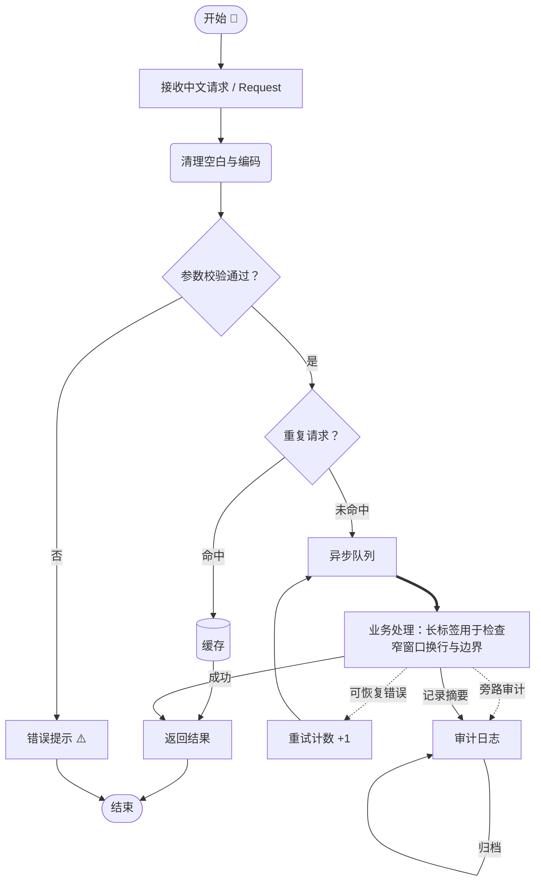

# 复杂图表专项：基本流程图

## 01 基本流程图

```mermaid
flowchart TD
  Start(["开始 🚀"])
  Input["接收中文请求 / Request"]
  Normalize("清理空白与编码")
  Valid{"参数校验通过？"}
  Duplicate{"重复请求？"}
  Cache[("缓存")]
  Queue["异步队列"]
  Worker["业务处理：长标签用于检查窄窗口换行与边界"]
  Audit["审计日志"]
  Result["返回结果"]
  Retry["重试计数 +1"]
  Error["错误提示 ⚠️"]
  End(["结束"])
  Start --> Input
  Input --> Normalize
  Normalize --> Valid
  Valid -->|是| Duplicate
  Valid -->|否| Error
  Duplicate -->|命中| Cache
  Duplicate -->|未命中| Queue
  Cache --> Result
  Queue ==> Worker
  Worker -->|成功| Result
  Worker -.->|可恢复错误| Retry
  Retry --> Queue
  Worker -.->|旁路审计| Audit
  Worker -->|记录摘要| Audit
  Audit -->|归档| Audit
  Result --> End
  Error --> End
```
