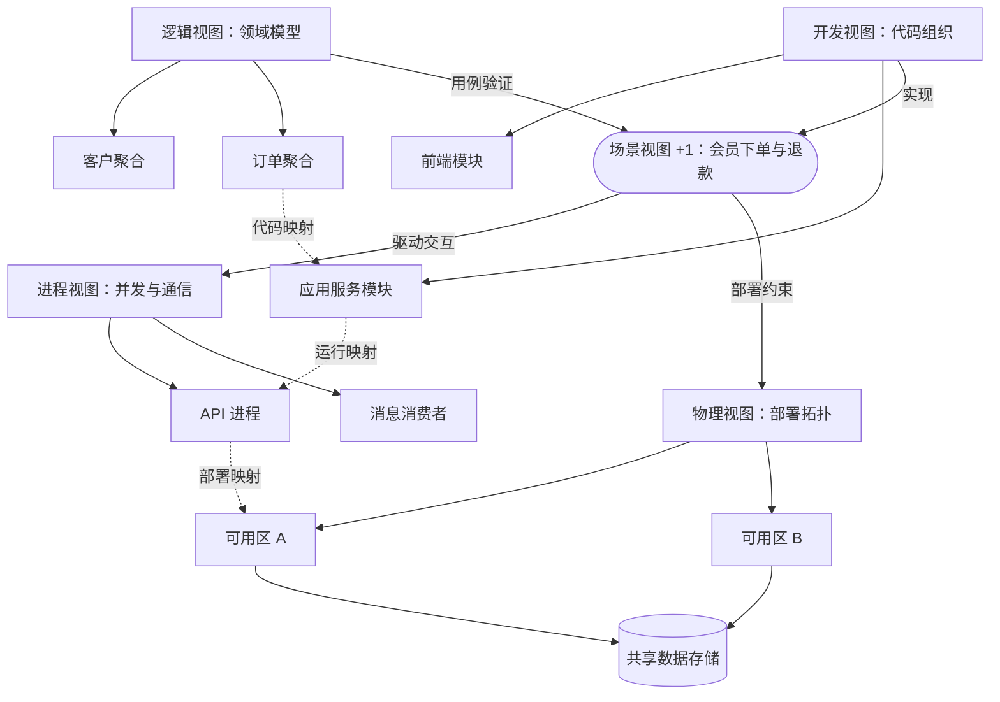

# 复杂图表专项：4+1 架构视图

## 02 4+1 架构视图

```mermaid
flowchart TB
  Scenario(["场景视图 +1：会员下单与退款"])
  Logical["逻辑视图：领域模型"]
  Customer["客户聚合"]
  Order["订单聚合"]
  Development["开发视图：代码组织"]
  Frontend["前端模块"]
  Backend["应用服务模块"]
  Process["进程视图：并发与通信"]
  API["API 进程"]
  Consumer["消息消费者"]
  Physical["物理视图：部署拓扑"]
  ZoneA["可用区 A"]
  ZoneB["可用区 B"]
  Storage[("共享数据存储")]
  Logical --> Customer
  Logical --> Order
  Development --> Frontend
  Development --> Backend
  Process --> API
  Process --> Consumer
  Physical --> ZoneA
  Physical --> ZoneB
  ZoneA --> Storage
  ZoneB --> Storage
  Logical -->|用例验证| Scenario
  Development -->|实现| Scenario
  Scenario -->|驱动交互| Process
  Scenario -->|部署约束| Physical
  Order -.->|代码映射| Backend
  Backend -.->|运行映射| API
  API -.->|部署映射| ZoneA
```
