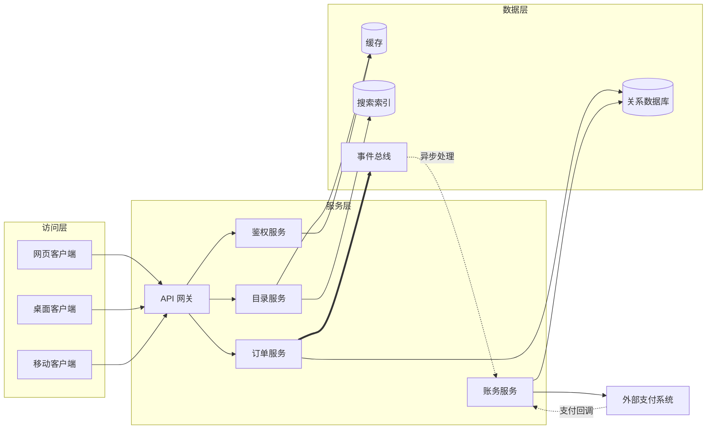

# 复杂图表专项：分层架构图

## 03 分层架构图

```mermaid
flowchart LR
  subgraph Clients["访问层"]
    Web["网页客户端"]
    Desktop["桌面客户端"]
    Mobile["移动客户端"]
  end
  subgraph Services["服务层"]
    Gateway["API 网关"]
    Auth["鉴权服务"]
    Catalog["目录服务"]
    Orders["订单服务"]
    Billing["账务服务"]
  end
  subgraph Data["数据层"]
    SQL[("关系数据库")]
    Cache[("缓存")]
    Search[("搜索索引")]
    Events["事件总线"]
  end
  External["外部支付系统"]
  Web --> Gateway
  Desktop --> Gateway
  Mobile --> Gateway
  Gateway --> Auth
  Gateway --> Catalog
  Gateway --> Orders
  Catalog --> Search
  Catalog --> Cache
  Orders --> SQL
  Orders ==> Events
  Events -.->|异步处理| Billing
  Billing --> External
  External -.->|支付回调| Billing
  Billing --> SQL
  Auth --> Cache
```
