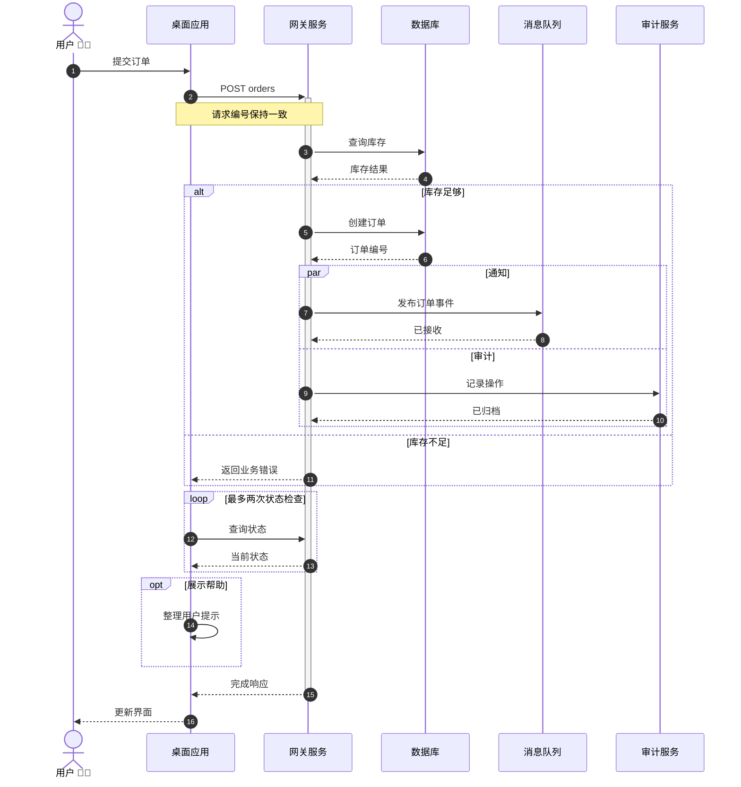

# 复杂图表专项：时序图

## 04 时序图

```mermaid
sequenceDiagram
  autonumber
  actor User as 用户 👩‍💻
  participant App as 桌面应用
  participant API as 网关服务
  participant DB as 数据库
  participant Queue as 消息队列
  participant Audit as 审计服务
  User->>App: 提交订单
  App->>+API: POST orders
  Note over App,API: 请求编号保持一致
  API->>DB: 查询库存
  DB-->>API: 库存结果
  alt 库存足够
    API->>DB: 创建订单
    DB-->>API: 订单编号
    par 通知
      API->>Queue: 发布订单事件
      Queue-->>API: 已接收
    and 审计
      API->>Audit: 记录操作
      Audit-->>API: 已归档
    end
  else 库存不足
    API-->>App: 返回业务错误
  end
  loop 最多两次状态检查
    App->>API: 查询状态
    API-->>App: 当前状态
  end
  opt 展示帮助
    App->>App: 整理用户提示
  end
  API-->>-App: 完成响应
  App-->>User: 更新界面
```
