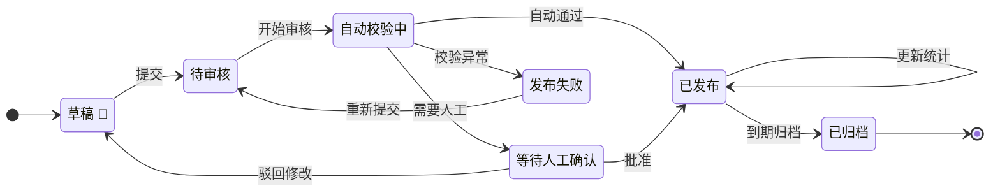

# 复杂图表专项：状态图

## 05 状态图

```mermaid
stateDiagram-v2
  direction LR
  state "草稿 📝" as Draft
  state "待审核" as Review
  state "自动校验中" as Checking
  state "等待人工确认" as Manual
  state "已发布" as Published
  state "发布失败" as Failed
  state "已归档" as Archived
  [*] --> Draft
  Draft --> Review: 提交
  Review --> Checking: 开始审核
  Checking --> Published: 自动通过
  Checking --> Manual: 需要人工
  Manual --> Published: 批准
  Manual --> Draft: 驳回修改
  Checking --> Failed: 校验异常
  Failed --> Review: 重新提交
  Published --> Published: 更新统计
  Published --> Archived: 到期归档
  Archived --> [*]
```
