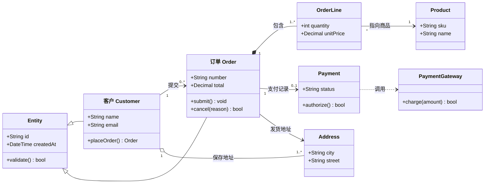

# 复杂图表专项：类图

## 06 类图

```mermaid
classDiagram
  direction LR
  class Entity {
    +String id
    +DateTime createdAt
    +validate() bool
  }
  class Customer["客户 Customer"] {
    +String name
    +String email
    +placeOrder() Order
  }
  class Order["订单 Order"] {
    +String number
    +Decimal total
    +submit() void
    +cancel(reason) bool
  }
  class OrderLine {
    +int quantity
    +Decimal unitPrice
  }
  class Product {
    +String sku
    +String name
  }
  class Address {
    +String city
    +String street
  }
  class Payment {
    +String status
    +authorize() bool
  }
  class PaymentGateway {
    +charge(amount) bool
  }
  Entity <|-- Customer
  Entity <|-- Order
  Customer "1" --> "0..*" Order : 提交
  Customer "1" o-- "1..*" Address : 保存地址
  Order "1" *-- "1..*" OrderLine : 包含
  OrderLine "*" --> "1" Product : 指向商品
  Order "1" --> "0..1" Payment : 支付记录
  Payment ..> PaymentGateway : 调用
  Order --> Address : 发货地址
```
