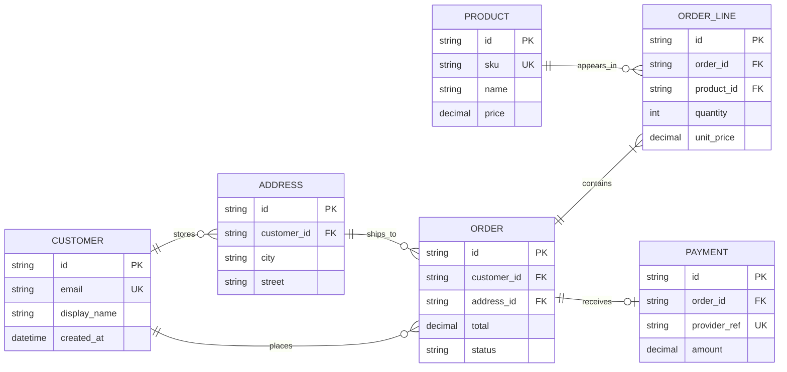

# 复杂图表专项：ER 数据模型

## 07 ER 数据模型

```mermaid
erDiagram
  direction LR
  CUSTOMER ||--o{ ORDER : places
  CUSTOMER ||--o{ ADDRESS : stores
  ORDER ||--|{ ORDER_LINE : contains
  PRODUCT ||--o{ ORDER_LINE : appears_in
  ORDER ||--o| PAYMENT : receives
  ADDRESS ||--o{ ORDER : ships_to
  CUSTOMER {
    string id PK
    string email UK
    string display_name
    datetime created_at
  }
  ADDRESS {
    string id PK
    string customer_id FK
    string city
    string street
  }
  ORDER {
    string id PK
    string customer_id FK
    string address_id FK
    decimal total
    string status
  }
  ORDER_LINE {
    string id PK
    string order_id FK
    string product_id FK
    int quantity
    decimal unit_price
  }
  PRODUCT {
    string id PK
    string sku UK
    string name
    decimal price
  }
  PAYMENT {
    string id PK
    string order_id FK
    string provider_ref UK
    decimal amount
  }
```
