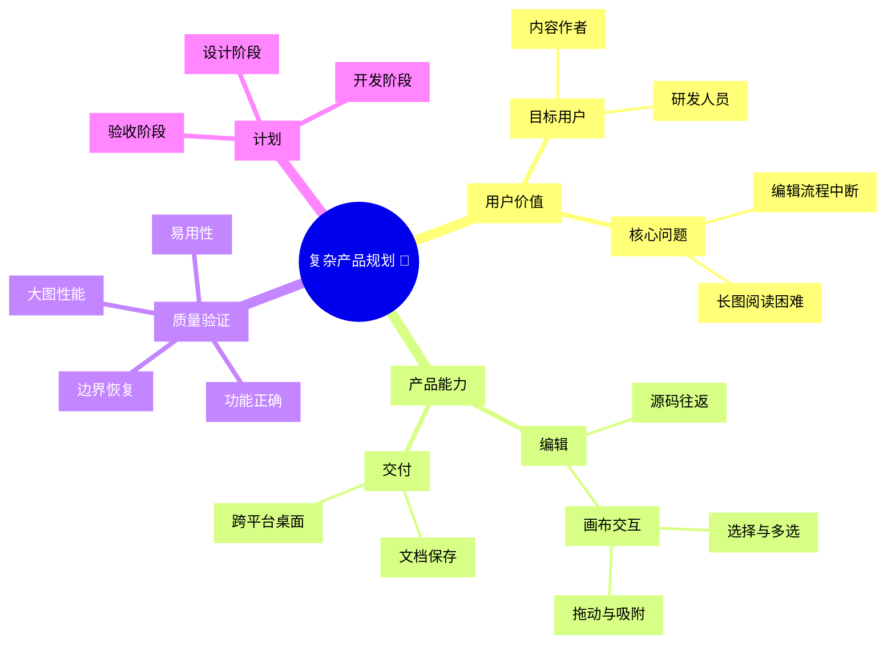

# 复杂图表专项：思维导图

## 08 思维导图

```mermaid
mindmap
  root((复杂产品规划 🚀))
    value["用户价值"]
      audience["目标用户"]
        author["内容作者"]
        engineer["研发人员"]
      problems["核心问题"]
        flow["编辑流程中断"]
        clarity["长图阅读困难"]
    capability["产品能力"]
      editing["编辑"]
        source["源码往返"]
        canvas["画布交互"]
          select["选择与多选"]
          move["拖动与吸附"]
      delivery["交付"]
        export["文档保存"]
        desktop["跨平台桌面"]
    quality["质量验证"]
      functional["功能正确"]
      usability["易用性"]
      performance["大图性能"]
      boundary["边界恢复"]
    schedule["计划"]
      design["设计阶段"]
      build["开发阶段"]
      accept["验收阶段"]
```
