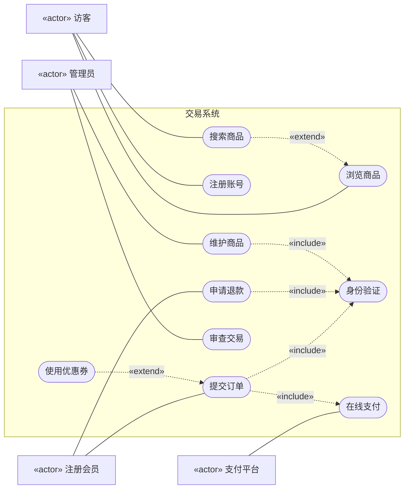

# 复杂图表专项：用例图

## 10 用例图

```mermaid
flowchart LR
  %% prosemap:usecase
  Guest["«actor» 访客"]
  Member["«actor» 注册会员"]
  Admin["«actor» 管理员"]
  PaymentProvider["«actor» 支付平台"]
  subgraph Shop["交易系统"]
    Browse(["浏览商品"])
    Search(["搜索商品"])
    Register(["注册账号"])
    Login(["身份验证"])
    Order(["提交订单"])
    Coupon(["使用优惠券"])
    Pay(["在线支付"])
    Refund(["申请退款"])
    Manage(["维护商品"])
    Audit(["审查交易"])
  end
  Guest --- Browse
  Guest --- Search
  Guest --- Register
  Member --- Order
  Member --- Refund
  Admin --- Manage
  Admin --- Audit
  PaymentProvider --- Pay
  Order -.->|«include»| Login
  Order -.->|«include»| Pay
  Coupon -.->|«extend»| Order
  Refund -.->|«include»| Login
  Manage -.->|«include»| Login
  Search -.->|«extend»| Browse
```
