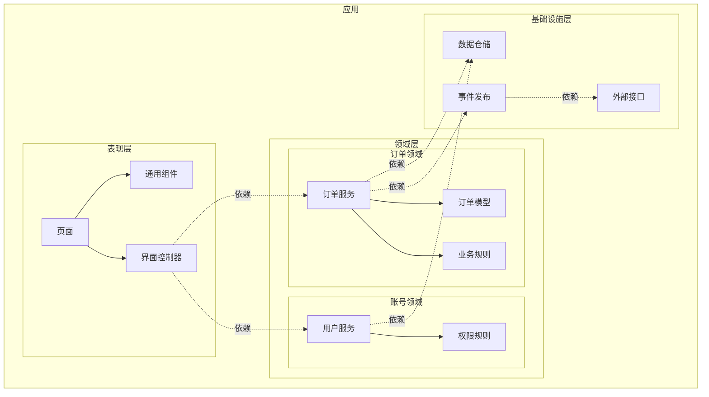

# 复杂图表专项：包结构图

## 11 包结构图

```mermaid
flowchart TB
  %% prosemap:package
  subgraph App["应用"]
    subgraph Presentation["表现层"]
      Pages["页面"]
      Components["通用组件"]
      Controllers["界面控制器"]
    end
    subgraph Domain["领域层"]
      subgraph Ordering["订单领域"]
        Orders["订单服务"]
        Models["订单模型"]
        Policies["业务规则"]
      end
      subgraph Accounts["账号领域"]
        Users["用户服务"]
        Permissions["权限规则"]
      end
    end
    subgraph Infrastructure["基础设施层"]
      Repository["数据仓储"]
      Gateway["外部接口"]
      Events["事件发布"]
    end
  end
  Pages --> Components
  Pages --> Controllers
  Controllers -.->|依赖| Orders
  Controllers -.->|依赖| Users
  Orders --> Models
  Orders --> Policies
  Orders -.->|依赖| Repository
  Orders -.->|依赖| Events
  Users --> Permissions
  Users -.->|依赖| Repository
  Events -.->|依赖| Gateway
```
