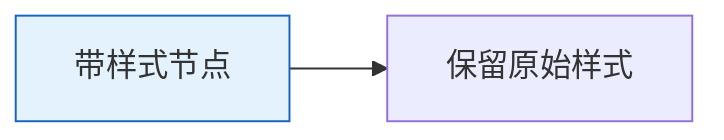
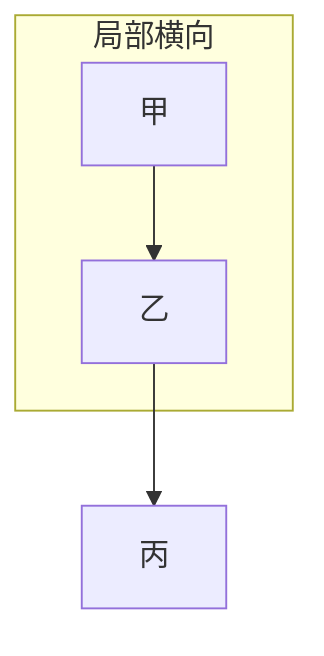
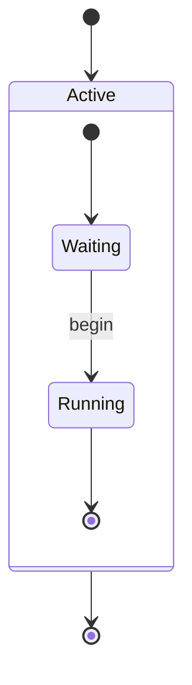

# 有效语法但超出画布编辑子集

预期真实 Mermaid 能渲染，画布给出只读预览并完整保留源码。

## 带样式定义的流程图

```mermaid
flowchart LR
  A[带样式节点] --> B[保留原始样式]
  classDef highlighted fill:#e3f2fd,stroke:#1565c0
  class A highlighted
```

## 子图局部方向

```mermaid
flowchart TB
  subgraph Group[局部横向]
    direction LR
    A[甲] --> B[乙]
  end
  B --> C[丙]
```

## 复合状态

```mermaid
stateDiagram-v2
  [*] --> Active
  state Active {
    [*] --> Waiting
    Waiting --> Running: begin
    Running --> [*]
  }
  Active --> [*]
```
